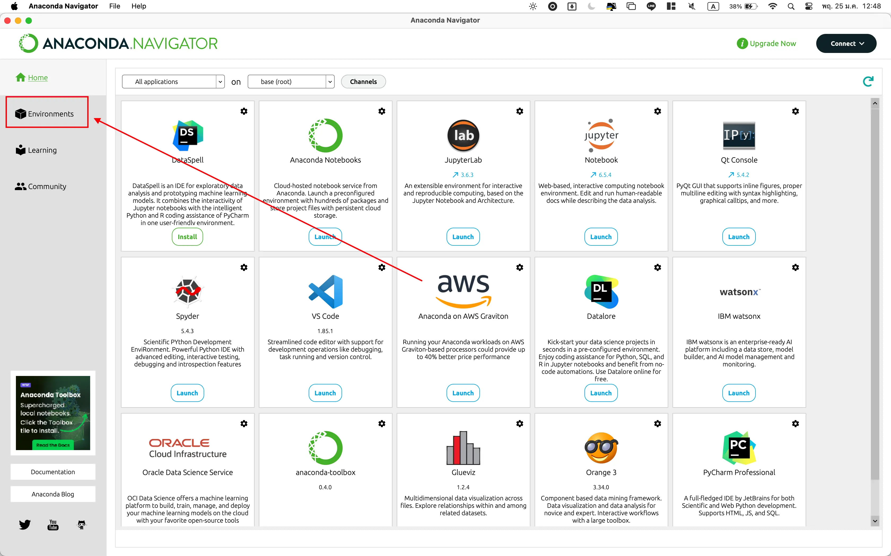
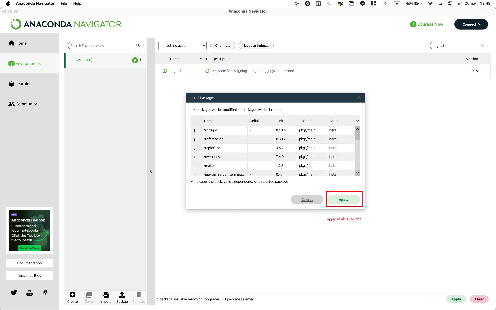
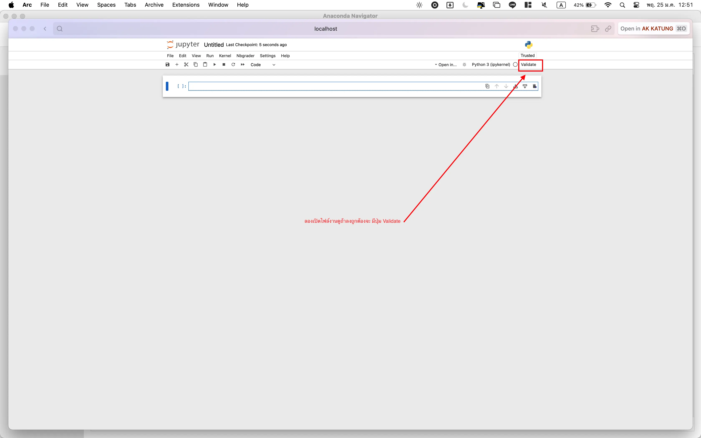

# วิธีการติดตั้ง Jupyter Notebook และ NBGrader
for English Instruction [english instruction version](https://github.com/AKKatung159/JupyterNB-nbgrader/blob/main/ReadmeEN.md)
## ติดตั้งใน Windows & MacOS

### Jupyter Notebook
1. ดาวน์โหลดและติดตั้ง [Anaconda](https://www.anaconda.com/products/individual) (เลือกรุ่นที่เหมาะกับระบบปฏิบัติการของคุณ)
   
    

2. เปิด Anaconda Navigator
   
### NBGrader
3. เลือก "Environments"
   
    

4. เลือก "Not Installed" จากรายการด้านซ้าย ในช่องค้นหา, พิพม์ `nbgrader`
   
    

5. กดเลือก `nbgrader` และ คลิกที่ `Apply` เพื่อติดตั้ง
   
    

    

6. เลือก "Home" และคลิกที่ "Launch" ในส่วนของ Jupyter Notebook
   
    

7. ลองเปิดไฟล์งานถ้ามีปุ่ม `validate` แสดงว่าลงสำเร็จ

    

---

## ติดตั้งใน Docker Compose

### การเตรียมพร้อม
- ต้องมี Docker และ Docker Compose ติดตั้งในเครื่องของคุณ. หากยังไม่ได้ติดตั้ง, คุณสามารถดาวน์โหลดและติดตั้ง Docker Desktop ที่รวมถึง Docker Compose ได้จาก [เว็บไซต์อย่างเป็นทางการของ Docker](https://www.docker.com/products/docker-desktop).

### ขั้นตอน

1. คลอน repository นี้ไปยังเครื่อง local ของคุณ:
    ```bash
    git clone https://github.com/AKKatung159/JupyterNB-nbgrader.git
    ```
    เข้าไปใน directory ที่ clone:
    ```bash
    cd JupyterNB-nbgrader
    ```

2. สร้างและรัน Docker containers โดยใช้ Docker Compose:
    ```bash
    docker-compose up -d --build
    ```

3. เมื่อ containers ทำงานแล้ว, เปิดเบราว์เซอร์ของคุณและไปที่:
    ```
    http://localhost:8888/
    ```
    คุณควรเห็นหน้าตาของ Jupyter Notebook.

## ข้อมูลเพิ่มเติม

สำหรับข้อมูลเพิ่มเติมเกี่ยวกับการใช้ nbgrader, ดูที่ [เอกสาร nbgrader](https://nbgrader.readthedocs.io/en/stable/).

---
### โดย. AK KATUNG
