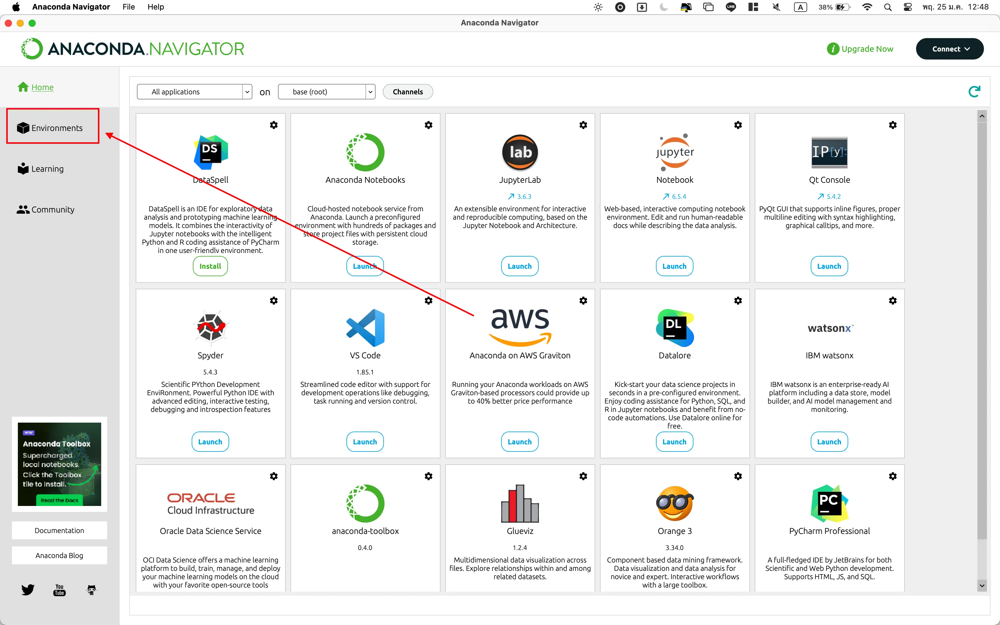
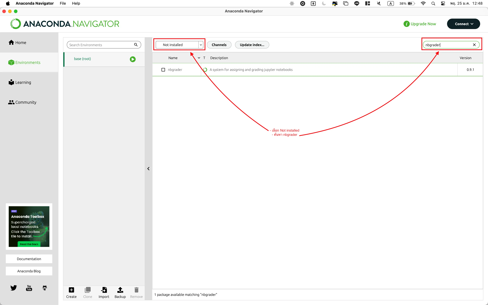
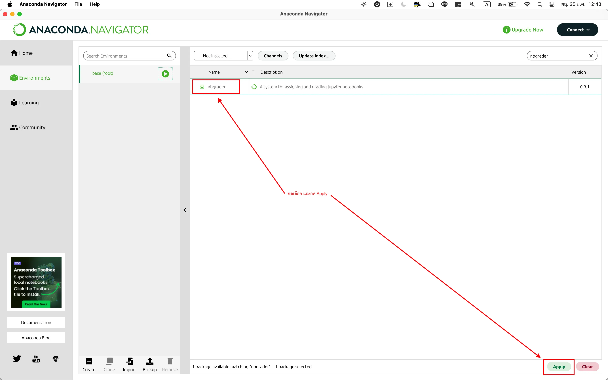
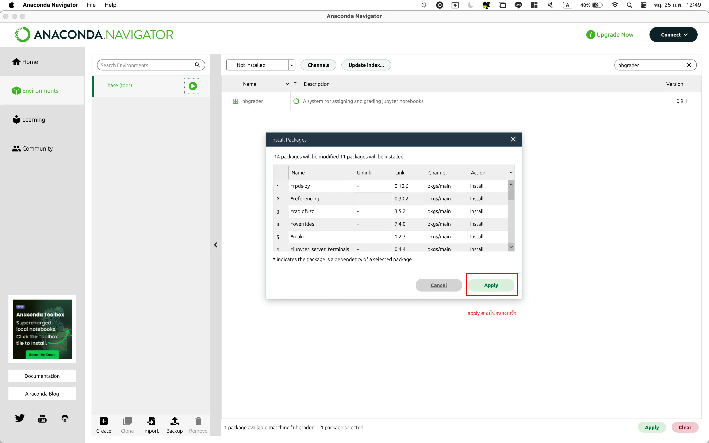
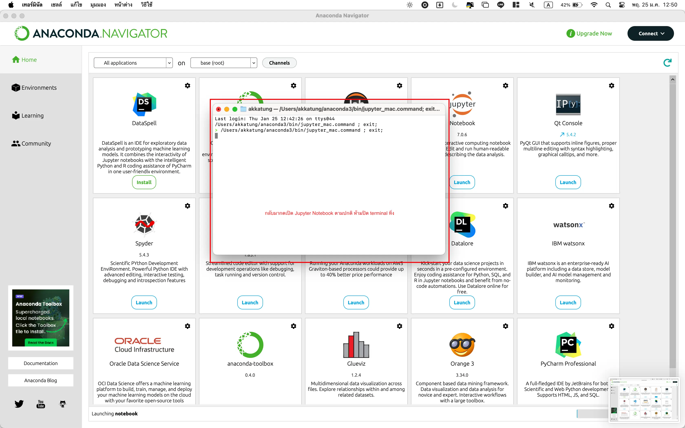
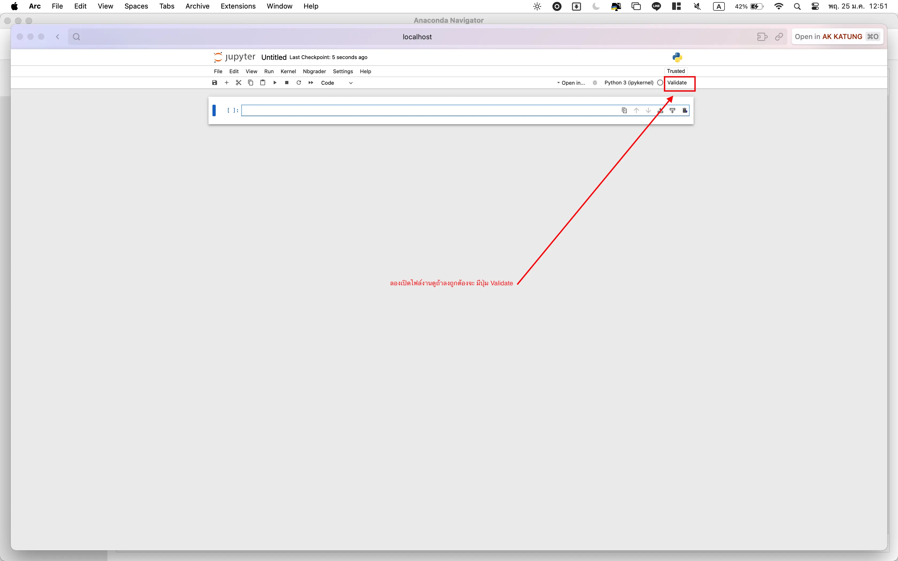

# Installing Jupyter Notebook and NBGrader

## Installation on Windows & MacOS

### Jupyter Notebook
1. Download and install [Anaconda](https://www.anaconda.com/products/individual) (Choose the version suitable for your operating system)
   
    

2. Open Anaconda Navigator

### NBGrader
3. Select "Environments"
   
    

4. Choose "Not Installed" from the left-hand menu. In the search box, type `nbgrader`
   
    

5. Click on `nbgrader` and then click on `Apply` to install
   
    

    

6. Select "Home" and click on "Launch" in the Jupyter Notebook section
   
    

7. Try opening a notebook, and if you see the `validate` button, it means the installation was successful.

    

---

## Installation using Docker Compose

### Prerequisites
- Docker and Docker Compose must be installed on your machine. If not installed, you can download and install Docker Desktop, which includes Docker Compose, from [Docker's official website](https://www.docker.com/products/docker-desktop).

### Steps

1. Clone this repository to your local machine:
    ```bash
    git clone https://github.com/AKKatung159/JupyterNB-nbgrader.git
    ```
    Navigate to the cloned directory:
    ```bash
    cd JupyterNB-nbgrader
    ```

2. Build and run the Docker containers using Docker Compose:
    ```bash
    docker-compose up -d --build
    ```

3. Once the containers are up and running, open your web browser and go to:
    ```
    http://localhost:8888/
    ```
    You should see the Jupyter Notebook interface.

## Additional Information

For more information on using nbgrader, refer to the [nbgrader documentation](https://nbgrader.readthedocs.io/en/stable/).

---
### By. AK KATUNG